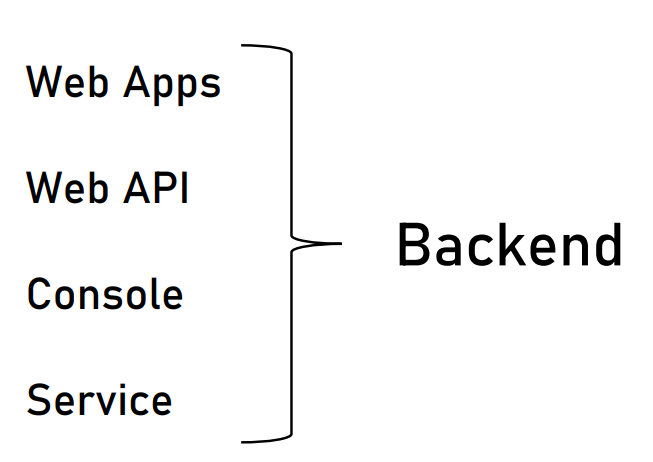
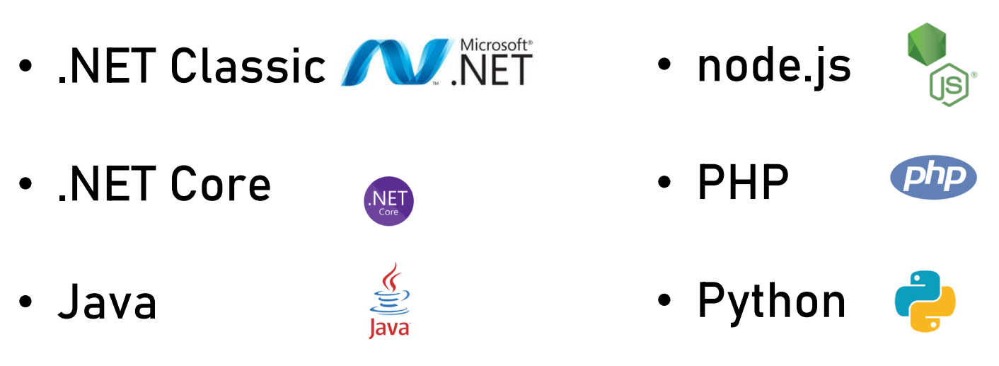
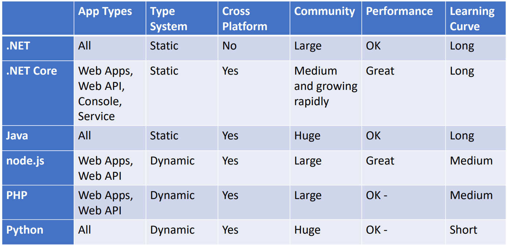
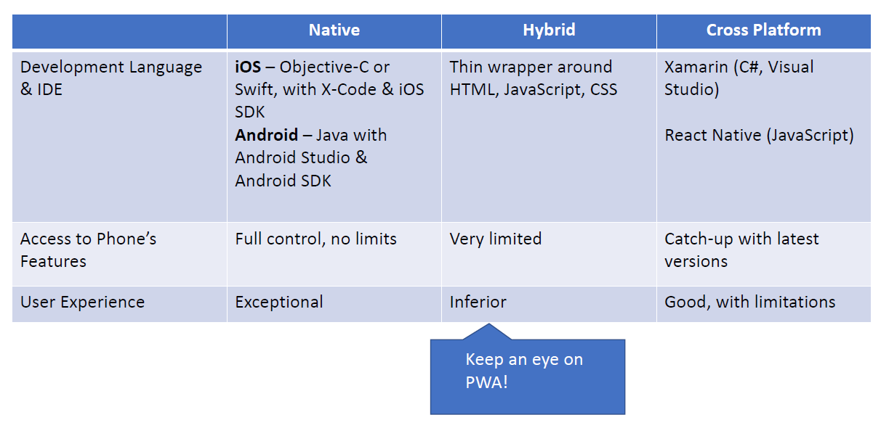
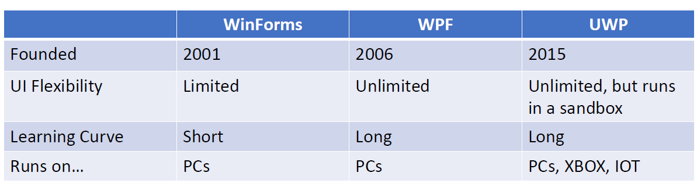

# System Design

### Content

1. [What is Software Architect](https://github.com/RukshanDias/System-Design#whats-software-architect)
2. [The Architectural mindset](https://github.com/RukshanDias/System-Design#the-architectural-mindset)
3. [The Architecture process](https://github.com/RukshanDias/System-Design#the-architecture-process)
4. [Working with System Requirements](https://github.com/RukshanDias/System-Design#working-with-system-requirments)
5. [Types of Applications](https://github.com/RukshanDias/System-Design#types-of-applications)
6. [Selecting Tech-Stacks](https://github.com/RukshanDias/System-Design#selecting-technology-stack)
7. Components Architecture
8. Design Patterns
9. System Architecture
10. Other Considerations

---

## What's Software Architect

### 3 main types of architectures

-   Infrastructure Architect
    -   Designs the infrastructure of system (all non-software elements).
    -   This includes Servers, VMs, Networks, Storage, etc:
    -   He should be familiar with system requirements.
-   Software Architect
    -   Also called as Solution, System architect.
    -   Responsible for the architecture of the software.
-   Enterprise Architect
    -   These people works with the top management.
    -   No development-oriented tasks.

### Responsibility of architect

-   "Developer knows what CAN be done - architect knows what SHOULD be done"
-   Baseline Requirements: **Fast, Secure, Reliable, Easy to maintain**

### Organizational Chart of an architect

-   
-   Career Paths:
    -   Dev -> Architect : common in small companies, >3 years of experience
    -   Dev -> Team Lead -> Jr.Architect / Proj.Manager : Common path
    -   Dev -> Team Lead -> Proj.Manager -> Sr.Architect : Can become an enterprise architect

---

## The Architectural mindset

-   Areas to focus on :
    -   Weakness
    -   Strengths
    -   Competition
    -   Growth Strategy
    -   Understanding the true north

---

## The Architecture process

### Steps:

1. Understand system requirements
    - 'What the system should Do'
    - Defined by system analyst
2. Understand non-functional requirements
    - Technical & service level attributes.
    - eg: Loads, volumes, performance
    - Much more important than regular reqirements.
    - Should be discussed with clients & system analyst.
3. Map components
    - Represent tasks of the system.
    - A simple idea on how the system should work.
    - 2 Goals:
        - Understand system functionality.
        - Communicate your understanding to the client.
4. Select Tech-stack
    - For Backend, FrontEnd and DataStore
    - Have to consider lot of factors when selecting.
5. Design architecture
    - Qualities of a well designed system:
        - loose coupling
        - Stateless
        - Scaling
        - Caching & more..
6. Write architecture document
    - Describes the full process of the system.
    - Must be relevant for all participant.

---

## Working with System Requirments

-   There're 2 main types of requirements:
    -   Functional requirements:
        -   What the system should do.
        -   Business flow, User interface, Business services
    -   Non-functional requirements:
        -   What should the system Deal with.
        -   [Non-functional requirements examples](https://en.wikipedia.org/wiki/Non-functional_requirement#Examples)
        -   Main 5 non-functional requirements:
            1. Performance
            2. Load
            3. Data volume
            4. Concurrent users
            5. SLA

### Performance

1. Always talk in numbers.
    - Human are less sensitive to actions that perform in less than 1 second.
2. Latency:
    - _"How much time does it take to perform a action"_
3. Troughput
    - _"How many tasks can be performed in given time frame"_

### Load

-   Quantity of work without crashing.
-   No of API requests without crashing.
-   Always plan for extream cases.

### Data Volume

-   How much data the systen will accumulate overtime.
-   Helps decide:
    -   Database type
    -   Designing queries
    -   Storage planing
-   This has 2 aspects:
    -   Volume required on start.
    -   Volume growth.

### Concurrent users

-   How many users will be using the system Simultaneously/same time.
-   Concurrent users vs Load:
    -   Load: only occur when user perform an action
    -   Concurrent users: Include 'dead times' as well.
    -   **Concurrent = Load x 10**

### SLA

-   Service Level Agreement
-   Describe the required Uptime for the system. Used in public cloud providers.
-   Server Uptime.

---

## Working with System Requirments

-   There're 2 main types of requirements:
    -   Functional requirements:
        -   What the system should do.
        -   Business flow, User interface, Business services
    -   Non-functional requirements:
        -   What should the system Deal with.
        -   [Non-functional requirements examples](https://en.wikipedia.org/wiki/Non-functional_requirement#Examples)
        -   Main 5 non-functional requirements:
            1. Performance
            2. Load
            3. Data volume
            4. Concurrent users
            5. SLA

### Performance

1. Always talk in numbers.
    - Human are less sensitive to actions that perform in less than 1 second.
2. Latency:
    - _"How much time does it take to perform a action"_
3. Troughput
    - _"How many tasks can be performed in given time frame"_

### Load

-   Quantity of work without crashing.
-   No of API requests without crashing.
-   Always plan for extream cases.

### Data Volume

-   How much data the systen will accumulate overtime.
-   Helps decide:
    -   Database type
    -   Designing queries
    -   Storage planing
-   This has 2 aspects:
    -   Volume required on start.
    -   Volume growth.

### Concurrent users

-   How many users will be using the system Simultaneously/same time.
-   Concurrent users vs Load:
    -   Load: only occur when user perform an action
    -   Concurrent users: Include 'dead times' as well.
    -   **Concurrent = Load x 10**

### SLA

-   Service Level Agreement
-   Describe the required Uptime for the system. Used in public cloud providers.
-   Server Uptime.

---

## Types of Applications

-   This will be decided after requirements are set.
-   Common types:

    #### 1. Web apps

    -   Most common
    -   communication between web server & browser using HTTP protocol.
    -   Request-Response based
    -   Best for system that requires:
        -   User Interface
        -   User initiated actions
        -   Large scale

    #### 2. Web API

    -   Main difference between Web APP vs API:
        -   This will serve json data.
        -   Client are not web browsers but other JS applications.
    -   **REST API** is the combination of,
        -   URL
        -   Parameter ($userId=001)
        -   HTTP verbs (GET)

    #### 3. Mobile

    -   Usually connects with Web API.
    -   Best for system that requires:
        -   High user interaction
        -   Location sensitive

    #### 4. Console

    -   No Fancy UI.
    -   Required technical knowledge.
    -   Limited interaction.

    #### 5. Service

    -   Console vs Service
        -   No UI at all.
        -   Managed by Service managers.

    #### 6. Desktop

    -   Has all the resources in PC.
    -   Lesser connection with internet.
    -   Best for user centric actions.

---

## Selecting Technology stack

-   3 Considerations on selecting tech-stack:
    1.  Can perform the required task.
    2.  Community: Stackoverflow
    3.  Popularity/trend: can check on google trend

#### Backend & service technology

-   
-   **Main candidates:**

    -   

-   **.NET**
    -   General purpose, object oriented, statically typed language.
    -   Founded by microsoft.
    -   Visual Studio is used as the IDE.
    -   Only for windows based apps.
    -   Slower than Nodejs.
-   **.NET Core**

    -   next generation dot net.
    -   Cross platform & higher performance than previous.

-   **Java**

    -   General purpose, Object oriented, statically typed language.
    -   Huge community.
    -   Still a good platform for web apps and APIs.

-   **Nodejs**

    -   Optimized for high-concurrent web apps.
    -   Javascript based, Dynamically typed language.
    -   Great performance.
    -   Not targeted for long running processes. So don't build services with this.

-   **PHP**

    -   easy to learn but messy.
    -   Focused on Web apps & APIs.

-   **Python**
    -   Popular scripting language.
    -   easy to learn & higher community.
-   

#### Front-end Technology

-   Web apps:
    -   Combination of html, css, javascript.
    -   Can use frameworks/libraries for javascript.
-   Mobile apps:
    -   3 types: Native, Hybrid, Cross-platform
    -   
-   Desktop apps:
    -   types of desktop app development technologies:
    -   

#### Data store

-   There're 2 types of data storing methods:
    -   relational - SQL
        -   Stores data in table
        -   Tables have concrete set of columns.
        -   Can have relation between tables.
        -   Transactions: atomic set of actions.
        -   Querying: SQL
    -   non-relational - NoSQL
        -   Main limitations are **Performance** & **Size**
        -   Emphasis on scale & performance.
        -   Schema-less
        -   Data stored in JSON format.

---