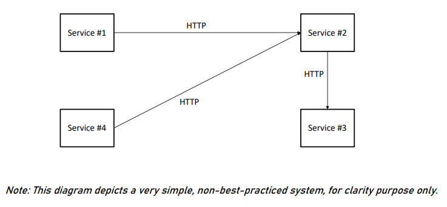
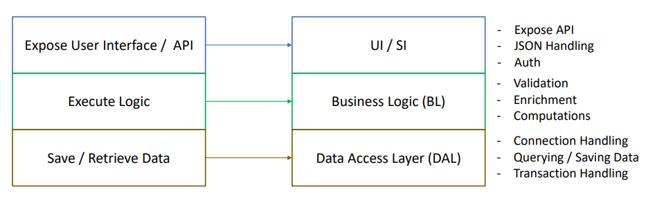
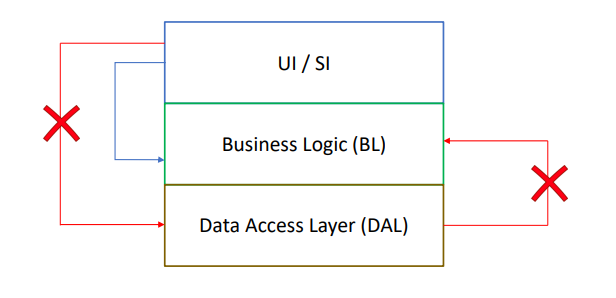
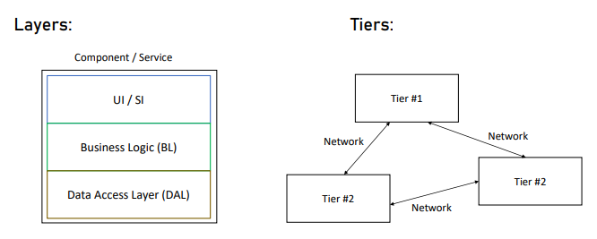

# System Design

### Content

1. [What is Software Architect](https://github.com/RukshanDias/System-Design#1-whats-software-architect)
2. [The Architectural mindset](https://github.com/RukshanDias/System-Design#2-the-architectural-mindset)
3. [The Architecture process](https://github.com/RukshanDias/System-Design#3-the-architecture-process)
4. [Working with System Requirements](https://github.com/RukshanDias/System-Design#4-working-with-system-requirments)
5. [Types of Applications](https://github.com/RukshanDias/System-Design#5-types-of-applications)
6. [Selecting Tech-Stacks](https://github.com/RukshanDias/System-Design#6-selecting-technology-stack)
7. [Meeting the \*-ilities](https://github.com/RukshanDias/System-Design#7-meeting-the--ilities)
8. [Components Architecture](https://github.com/RukshanDias/System-Design#8-components-architecture)
9. Design Patterns
10. System Architecture
11. Other Considerations
12. Architecture document
13. Advanced topics

---

## 1. What's Software Architect

### 3 main types of architectures

-   Infrastructure Architect
    -   Designs the infrastructure of system (all non-software elements).
    -   This includes Servers, VMs, Networks, Storage, etc:
    -   He should be familiar with system requirements.
-   Software Architect
    -   Also called as Solution, System architect.
    -   Responsible for the architecture of the software.
-   Enterprise Architect
    -   These people works with the top management.
    -   No development-oriented tasks.

### Responsibility of architect

-   "Developer knows what CAN be done - architect knows what SHOULD be done"
-   Baseline Requirements: **Fast, Secure, Reliable, Easy to maintain**

### Organizational Chart of an architect

-   
-   Career Paths:
    -   Dev -> Architect : common in small companies, >3 years of experience
    -   Dev -> Team Lead -> Jr.Architect / Proj.Manager : Common path
    -   Dev -> Team Lead -> Proj.Manager -> Sr.Architect : Can become an enterprise architect

---

## 2. The Architectural mindset

-   Areas to focus on :
    -   Weakness
    -   Strengths
    -   Competition
    -   Growth Strategy
    -   Understanding the true north

---

## 3. The Architecture process

### Steps:


1. Understand system requirements
    - 'What the system should Do'
    - Defined by system analyst
2. Understand non-functional requirements
    - Technical & service level attributes.
    - eg: Loads, volumes, performance
    - Much more important than regular requirements.
    - Should be discussed with clients & system analyst.
3. Map components
    - Represent tasks of the system.
    - A simple idea on how the system should work.
    - 2 Goals:
        - Understand system functionality.
        - Communicate your understanding to the client.
4. Select Tech-stack
    - For Backend, FrontEnd and DataStore
    - Have to consider lot of factors when selecting.
5. Design architecture
    - Qualities of a well designed system:
        - loose coupling
        - Stateless
        - Scaling
        - Caching & more..
6. Write architecture document
    - Describes the full process of the system.
    - Must be relevant for all participant.

---

## 4. Working with System Requirements

-   There're 2 main types of requirements:
    -   Functional requirements:
        -   What the system should do.
        -   Business flow, User interface, Business services
    -   Non-functional requirements:
        -   What should the system Deal with.
        -   [Non-functional requirements examples](https://en.wikipedia.org/wiki/Non-functional_requirement#Examples)
        -   Main 5 non-functional requirements:
            1. Performance
            2. Load
            3. Data volume
            4. Concurrent users
            5. SLA

### Performance

1. Always talk in numbers.
    - Human are less sensitive to actions that perform in less than 1 second.
2. Latency:
    - _"How much time does it take to perform a action"_
3. Troughput
    - _"How many tasks can be performed in given time frame"_

### Load

-   Quantity of work without crashing.
-   No of API requests without crashing.
-   Always plan for extreme cases.

### Data Volume

-   How much data the system will accumulate overtime.
-   Helps decide:
    -   Database type
    -   Designing queries
    -   Storage planing
-   This has 2 aspects:
    -   Volume required on start.
    -   Volume growth.

### Concurrent users

-   How many users will be using the system Simultaneously/same time.
-   Concurrent users vs Load:
    -   Load: only occur when user perform an action
    -   Concurrent users: Include 'dead times' as well.
    -   **Concurrent = Load x 10**

### SLA

-   Service Level Agreement
-   Describe the required Uptime for the system. Used in public cloud providers.
-   Server Uptime.

---

## 5. Types of Applications

-   This will be decided after requirements are set.
-   Common types:

    #### 1. Web apps

    -   Most common
    -   communication between web server & browser using HTTP protocol.
    -   Request-Response based
    -   Best for system that requires:
        -   User Interface
        -   User initiated actions
        -   Large scale

    #### 2. Web API

    -   Main difference between Web APP vs API:
        -   This will serve json data.
        -   Client are not web browsers but other JS applications.
    -   **REST API** is the combination of,
        -   URL
        -   Parameter ($userId=001)
        -   HTTP verbs (GET)

    #### 3. Mobile

    -   Usually connects with Web API.
    -   Best for system that requires:
        -   High user interaction
        -   Location sensitive

    #### 4. Console

    -   No Fancy UI.
    -   Required technical knowledge.
    -   Limited interaction.

    #### 5. Service

    -   Console vs Service
        -   No UI at all.
        -   Managed by Service managers.

    #### 6. Desktop

    -   Has all the resources in PC.
    -   Lesser connection with internet.
    -   Best for user centric actions.

---

## 6. Selecting Technology stack

-   3 Considerations on selecting tech-stack:
    1.  Can perform the required task.
    2.  Community: Stackoverflow
    3.  Popularity/trend: can check on google trend

#### Backend & service technology

-   
-   **Main candidates:**

    -   

-   **.NET**
    -   General purpose, object oriented, statically typed language.
    -   Founded by microsoft.
    -   Visual Studio is used as the IDE.
    -   Only for windows based apps.
    -   Slower than Nodejs.
-   **.NET Core**

    -   next generation dot net.
    -   Cross platform & higher performance than previous.

-   **Java**

    -   General purpose, Object oriented, statically typed language.
    -   Huge community.
    -   Still a good platform for web apps and APIs.

-   **Nodejs**

    -   Optimized for high-concurrent web apps.
    -   Javascript based, Dynamically typed language.
    -   Great performance.
    -   Not targeted for long running processes. So don't build services with this.

-   **PHP**

    -   easy to learn but messy.
    -   Focused on Web apps & APIs.

-   **Python**
    -   Popular scripting language.
    -   easy to learn & higher community.
-   

#### Front-end Technology

-   Web apps:
    -   Combination of html, css, javascript.
    -   Can use frameworks/libraries for javascript.
-   Mobile apps:
    -   3 types: Native, Hybrid, Cross-platform
    -   
-   Desktop apps:
    -   types of desktop app development technologies:
    -   

#### Data store

-   There're 2 types of data storing methods:
    -   relational - SQL
        -   Stores data in table
        -   Tables have concrete set of columns.
        -   Can have relation between tables.
        -   Transactions: atomic set of actions.
        -   Querying: SQL
    -   non-relational - NoSQL
        -   Main limitations are **Performance** & **Size**
        -   Emphasis on scale & performance.
        -   Schema-less
        -   Data stored in JSON format.

---

## 7. Meeting the \*-ilities

-   \*ilities are **quality attributes** that defines app capabilities.

#### 1. Scalability

-   "Adding computing resources without any interruptions."
-   Scalability types:
    1. Scale up - vertical scaling:
        - increase the cpu of the vm.
    2. Scale down - horizontal scaling:
        - adding another vm.
-   Why scale down is better than scale up?:
    -   Redundancy - if 1 vm crashes the load can move to the other. Load balancing.
    -   No limits - cpu power has limit, but no of vm don't

#### 2. Manageability

-   "Knows what's going on and take actions accordingly"
-   Should have a monitoring platform on app status.

#### 3. Modularity

-   "A system that build from building blocks, that can change without affecting whole system".
-   On modularizing component, it makes easy to change, test and deploy code.

#### 4. Extensibility

-   "A system that its functionality can be extended without modifying existing code".
-   Using a plugin framework with dependency injection can be given as examples.

#### 5. Testability

-   "How easy it is to test the application"
-   Types of testing methods:
    -   Manual:
        -   Nothing to do with testability.
    -   End to end:
        -   An Automated UI testing.
    -   Integration:
        -   Test a method that will trigger chain of action, and result a specific outcome.
    -   Unit:
        -   Test methods by passing parameters and whether they're returning correct values.

---

## 8. Components Architecture

-   What is Software component?
    -   A piece of code that runs in a single process. Aka not distributed.
-   What is distributed systems?

    -   Composed of independent software components.
    -   Deployed on separate processes, containers, servers.
    -   Modern systems are usually distributed.
    -   Communicate using a network protocol.
    -   examples: Microservices, server application & more.
    -   

-   2 levels of software architecture
    1. Component's architecture
        - Deals with inner components of the code.
        - Interact with other components.
        - Make the code fast & easy to maintain.
    2. System architecture
        - Bigger picture.
        - Make sure the system is Scalable, Reliable, Fast & Easy to maintain.

#### Layers

-   A good software component will always have layers.
-   
-   Purpose of Layers:
    -   Able to write well formed & focused code.
    -   modularity.
-   Concepts of Layers:

    -   **Code flow**:
        -   A layer can only call a layer that directly benefits the code
        -   A code can never call a code in a layer above it.
        -   
    -   **Loose coupling**
        -   Layer communicating with each other with minimum impact when there's a change.
        -   This also called, dependency injection.
    -   **Exception Handling**
        -   Each layer must hide it's inner exceptions & not let other layers to know about it.

-   Layer vs Tier
    -   Layer: code that's part of component.
    -   Tier: Distributed piece of code. independent components.
    -   

---

## 8. Components Architecture

-   What is Software component?
    -   A piece of code that runs in a single process. Aka not distributed.
-   What is distributed systems?

    -   Composed of independent software components.
    -   Deployed on separate processes, containers, servers.
    -   Modern systems are usually distributed.
    -   Communicate using a network protocol.
    -   examples: Microservices, server application & more.
    -   

-   2 levels of software architecture
    1. Component's architecture
        - Deals with inner components of the code.
        - Interact with other components.
        - Make the code fast & easy to maintain.
    2. System architecture
        - Bigger picture.
        - Make sure the system is Scalable, Reliable, Fast & Easy to maintain.

#### Layers

-   A good software component will always have layers.
-   
-   Purpose of Layers:
    -   Able to write well formed & focused code.
    -   modularity.
-   Concepts of Layers:

    -   **Code flow**:
        -   A layer can only call a layer that directly benefits the code
        -   A code can never call a code in a layer above it.
        -   
    -   **Loose coupling**
        -   Layer communicating with each other with minimum impact when there's a change.
        -   This also called, dependency injection.
    -   **Exception Handling**
        -   Each layer must hide it's inner exceptions & not let other layers to know about it.

-   Layer vs Tier
    -   Layer: code that's part of component.
    -   Tier: Distributed piece of code. independent components.
    -   

#### Interfaces

-   Declares the signature of an implementation.
-   This makes code to be loosely coupled.
-   Always try to use Interfaces, instead of direct reference between classes. (using new keyword)

#### Dependency Injection

-   "A technique where one object supplies the dependencies of another object."
-   Makes the code modular, flexible & easy to maintain.
-   Dependency injection using _Factory method_.
    -   

#### SOLID Principles

[solid principles video 1](https://www.youtube.com/watch?v=kF7rQmSRlq0)
[solid principles video 2](https://www.youtube.com/watch?v=x2y_lsIdC6c)


-   **Single responsibility**

    -   
    -   2 separate methods to compose and write the msg.

-   **Open / Closed**
    -   Able to extend the functionality without modifying the code.
-   **Liskov Substitution**
    -   Every subclass should be substitutable/exchangeable for their parent class. without any errors/issues.
-   **Interface Segregation**
    -   
    -   Allows to implement only necessary functionalities.
-   **Dependency Inversion**
    -   High-level module must not depend on the low-level module, but they should depend on abstractions.

#### Naming Conventions

-   Set of rules for naming elements. Which makes code more readable.
-   Two types:
    1. Structure - casing, underscore
    2. Content - words used in name

##### 1. Structure

-   Camel Case
    -   more than one word.
    -   used for naming CLASSES.
    -   Upper:
        -   class **C**arEngine
    -   Lower
        -   public **s**tartEngine
-   Underscore
    -   words separated with underscore.
    -   Lower - for naming **variables**.
        -   num_of_students = 10
    -   Upper - for naming **constants**.
        -   CONST DAYS_IN_WEEK = 7
-   Hungarian Notation
    -   Data type should be part of the name.
    -   Mostly used in 90's.
    -   string strFirstName = "name".

##### 2. Content

-   Class names -> Nouns - entity
    -   DataRetriever
-   Method names -> Verbs - action
    -   RetrieveData

#### Exception Handling

-   Only catch exception, if you have something to do with it.
-   Always catch a specific exception.
    -   catch(ModuleNotFound)
-   Identify code fragments that may raise exceptions, and add try..catch on them.

#### Logging

-   Has two purposes
    -   Track errors
    -   Gather data
        -   Which module is mostly visited.
        -   Performance
        -   User's flow
-   '[Kibana](https://www.elastic.co/kibana)' is one of the popular logging tools.

---

## 9. Design Patterns

-   Collection of general, reusable solutions for common problems.
-   Design patterns = Micro architecture

### Factory Pattern

-   " Creating objects without specifying exact class "
-   Why?
    -   avoid strong coupling.
    -   easy to maintain.

```
>> Classes:
    - Burger : abstract interface
    - ChickenBurger -> implements Burger
    - VeggieBurger -> implements Burger
===========================================

public class BurgerFactory {
    public IShape createBurger(string burgerType) {  // factory implementation
        switch (burgerType) {
            case "chicken" :
                return new ChickenBurger();
            case "veggie" :
                return new VeggieBurger();
            default :
                return null;
        }
    }
}

public class Restaurant {
    public Burger orderBurger(burgerType: string) {
        BurgerFactory factory = new BurgerFactory();
        Burger myBurger = factory.createBurger(burgerType);  // applying
        myBurger.prepare();
        return myBurger;
    }
}
```
